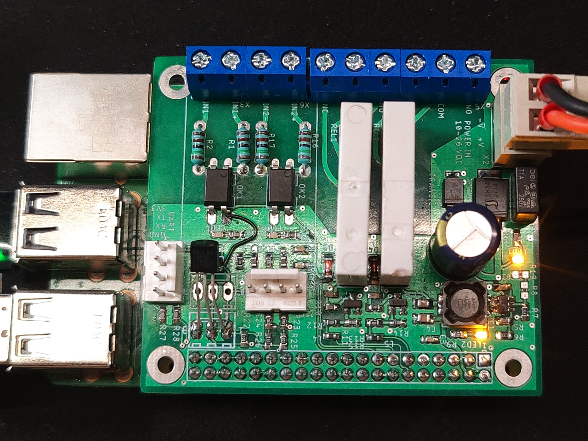

# rpi_industrial_hat_rev02
Raspberry Pi hat with industrial-style 2xDI+2xDQ+1W

## Features:
- power supply input 10-26 V with fuse protection, overvoltage protection and reverse polarity protection
- possible to set low voltage level eg. to protect 12V baterry from draining.
- 2 relays for outputs (both NO and NC contacts accesible)
- 2 optocouplers for inputs (can be used SMD or THT versions in 4-pin package)
- 3-pin connector for 1-Wire devices (eg. D18B20 thermometers)
- terminal blocks connectors
- UART conenctor
- I2C connector
- Domoticz and Home Assistant friendly

## Signals used from Raspberry Pi GPIO connector:
- GPIO04: 1-wire
- GPIO17: Relay #2
- GPIO18: Relay #1
- GPIO22: Input #1
- GPIO27: Input #2

Photo of the board (revision 01 with some small mistake, corrected in current revision):

I've included:
- Schematic in PDF
- Board visualisation in PDF
- Gerber files in .zip ready to be send to PCB manufacturer
- Eagle files
